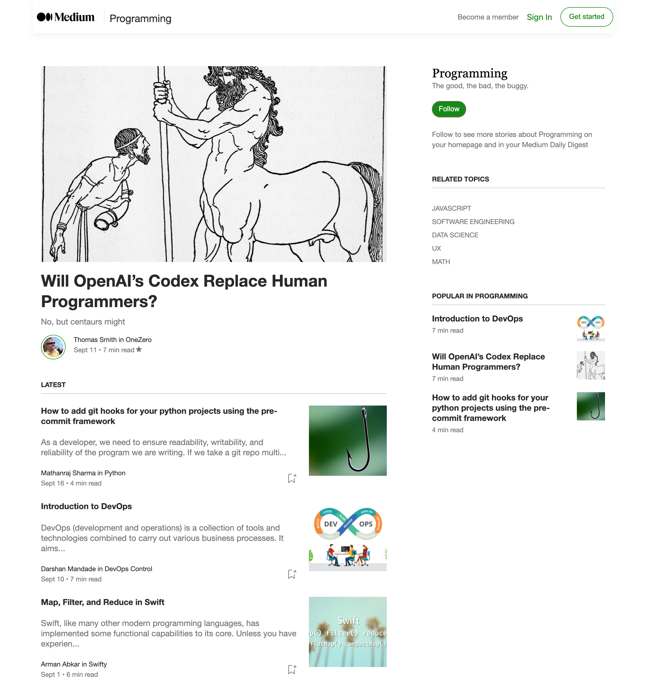

# WEBSITES MEDIUM

### Overview
A React recreation of the medium website.

### 1. Project's objective
To continue to learn how to use React based on components, and the ability to follow designs.

### 2. Design and layout
A replica of the medium website which is built using React.
The CSS was lifted and shifted using Chrome's "Inspect" tool.
The image below is the original screen.

### 3. Technical development

#### 3.1 Technologies
- HTML/HTML5
- CSS/SCSS
- Javascript/React
- IDE PHP Storm

#### 3.2 HTML/HTML5
- Uses HTML5 standards i.e. nav, main and aside.

#### 3.3 CSS/SCSS
- The SCSS uses or includes the following:
    - atomic design methodology, and
    - B.E.M methodology for naming classes.

#### 3.4 Javascript/React
- Functionalities included:
  - _array filter_ to get the featured article and _array map_ for the output,
  - _array filter_ to get the latest articles, _sort_ by date from latest to earliest and _array map_ for the output, and
  - _array filter_ and _sort_ to get the first three popular articles i.e. the highest number of claps in descending order.
